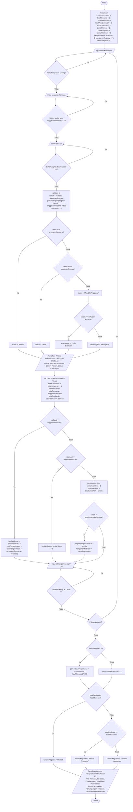

# Flowchart Program Terintegrasi

**Penanggung Jawab:** Nadin Arifa Salsabila (322610009) & Bryant Anthony Kores Obhetan (322610003)

### Kode Sumber Diagram Alir (Mermaid)

```mermaid
flowchart TD
    Start([Mulai]) --> Init["Inisialisasi:<br>totalKomponen = 0, totalRencana = 0, totalRealisasi = 0<br>totalPenghematan = 0, totalKelebihan = 0<br>jumlahHemat = 0, jumlahTepat = 0, jumlahMelebihi = 0<br>penyimpanganTerbesar = 0, komponenTerbesar = '-', kondisiKegiatan = '-'"]
    
    Init --> InputNama[/"Input namaKomponen"/]
    InputNama --> ValNama{"namaKomponen kosong?"}
    ValNama -- Ya --> InputNama
    ValNama -- Tidak --> InputRencana[/"Input anggaranRencana"/]
    
    InputRencana --> ValRencana{"Bukan angka atau anggaranRencana <= 0?"}
    ValRencana -- Ya --> InputRencana
    ValRencana -- Tidak --> InputRealisasi[/"Input realisasi"/]
    
    InputRealisasi --> ValRealisasi{"Bukan angka atau realisasi < 0?"}
    ValRealisasi -- Ya --> InputRealisasi
    ValRealisasi -- Tidak --> ProcA["MODUL A:<br>selisih = realisasi - anggaranRencana<br>persenPenyimpangan = (selisih / anggaranRencana) * 100<br>keterangan = '-'"]
    
    ProcA --> CondStatus{"realisasi < anggaranRencana?"}
    CondStatus -- Ya --> StatusHemat["status = 'Hemat'"]
    CondStatus -- Tidak --> CondTepat{"realisasi == anggaranRencana?"}
    
    CondTepat -- Ya --> StatusTepat["status = 'Tepat'"]
    CondTepat -- Tidak --> StatusMelebihi["status = 'Melebihi Anggaran'"]
    
    StatusMelebihi --> CondKeterangan{"selisih <= 10% dari rencana?"}
    CondKeterangan -- Ya --> KetEvaluasi["keterangan = 'Perlu Evaluasi'"]
    CondKeterangan -- Tidak --> KetPeringatan["keterangan = 'Peringatan'"]
    
    StatusHemat --> PrintA[/"Tampilkan Rincian Pemeriksaan Komponen (Modul A):<br>Nama, Rencana, Realisasi, Selisih, Persen, Status, Keterangan"/]
    StatusTepat --> PrintA
    KetEvaluasi --> PrintA
    KetPeringatan --> PrintA
    
    PrintA --> ProcB["MODUL B (Akumulasi Real-Time):<br>totalKomponen = totalKomponen + 1<br>totalRencana = totalRencana + anggaranRencana<br>totalRealisasi = totalRealisasi + realisasi"]
    
    ProcB --> CondBStat{"realisasi < anggaranRencana?"}
    CondBStat -- Ya --> StatHematB["jumlahHemat = jumlahHemat + 1<br>totalPenghematan = totalPenghematan + (anggaranRencana - realisasi)"]
    CondBStat -- Tidak --> CondBTepat{"realisasi == anggaranRencana?"}
    
    CondBTepat -- Ya --> StatTepatB["jumlahTepat = jumlahTepat + 1"]
    CondBTepat -- Tidak --> StatLebihB["jumlahMelebihi = jumlahMelebihi + 1<br>totalKelebihan = totalKelebihan + selisih"]
    
    StatLebihB --> CheckPeak{"selisih > penyimpanganTerbesar?"}
    CheckPeak -- Ya --> UpdatePeak["penyimpanganTerbesar = selisih<br>komponenTerbesar = namaKomponen"]
    CheckPeak -- Tidak --> PromptLoop
    
    StatHematB --> PromptLoop[/"Input pilihan periksa lagi? (y/t)"/]
    StatTepatB --> PromptLoop
    UpdatePeak --> PromptLoop
    
    PromptLoop --> ValChoice{"Pilihan bukan y, Y, t, atau T?"}
    ValChoice -- Ya --> PromptLoop
    ValChoice -- Tidak --> CheckRepeat{"Pilihan y atau Y?"}
    CheckRepeat -- Ya --> InputNama
    
    CheckRepeat -- Tidak --> CheckDiv{"totalRencana > 0?"}
    CheckDiv -- Ya --> CalcPenyerapan["persentasePenyerapan = (totalRealisasi / totalRencana) * 100"]
    CheckDiv -- Tidak --> ZeroPenyerapan["persentasePenyerapan = 0"]
    
    CalcPenyerapan --> CheckOverall{"totalRealisasi < totalRencana?"}
    ZeroPenyerapan --> CheckOverall
    
    CheckOverall -- Ya --> KondisiHemat["kondisiKegiatan = 'Hemat'"]
    CheckOverall -- Tidak --> CheckOverallTepat{"totalRealisasi == totalRencana?"}
    
    CheckOverallTepat -- Ya --> KondisiTepat["kondisiKegiatan = 'Sesuai Anggaran'"]
    CheckOverallTepat -- Tidak --> KondisiLebih["kondisiKegiatan = 'Melebihi Anggaran'"]
    
    KondisiHemat --> PrintB[/"Tampilkan Laporan Rekapitulasi Akhir (Modul B):<br>Total Rencana, Realisasi, Penghematan, Kelebihan, Penyerapan,<br>Statistik Komponen, Penyimpangan Terbesar, dan Kondisi Keseluruhan"/]
    KondisiTepat --> PrintB
    KondisiLebih --> PrintB
    
    PrintB --> EndProg([Selesai])
```
