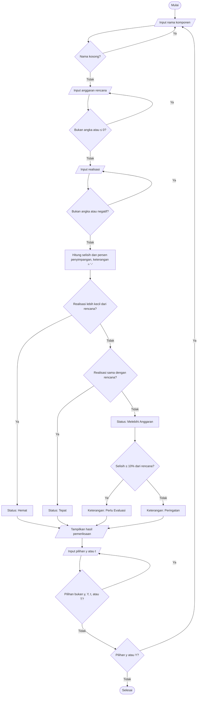

**Penanggung jawab:** Nadin Arifa Salsabila / 322610009

## Flowchart

```mermaid
flowchart TD
    A([Mulai]) --> B[/"Input nama komponen"/]
    B --> C{"Nama kosong?"}
    C -- Ya --> B
    C -- Tidak --> D[/"Input anggaran rencana"/]
    D --> E{"Bukan angka atau ≤ 0?"}
    E -- Ya --> D
    E -- Tidak --> F[/"Input realisasi"/]
    F --> G{"Bukan angka atau negatif?"}
    G -- Ya --> F
    G -- Tidak --> H["Hitung selisih dan persen penyimpangan, keterangan = '-'"]
    H --> I{"Realisasi lebih kecil dari rencana?"}
    I -- Ya --> J["Status: Hemat"]
    I -- Tidak --> K{"Realisasi sama dengan rencana?"}
    K -- Ya --> L["Status: Tepat"]
    K -- Tidak --> M["Status: Melebihi Anggaran"]
    M --> N{"Selisih ≤ 10% dari rencana?"}
    N -- Ya --> O["Keterangan: Perlu Evaluasi"]
    N -- Tidak --> P["Keterangan: Peringatan"]
    J --> Q[/"Tampilkan hasil pemeriksaan"/]
    L --> Q
    O --> Q
    P --> Q
    Q --> R[/"Input pilihan y atau t"/]
    R --> S{"Pilihan bukan y, Y, t, atau T?"}
    S -- Ya --> R
    S -- Tidak --> T{"Pilihan y atau Y?"}
    T -- Ya --> B
    T -- Tidak --> U([Selesai])
```