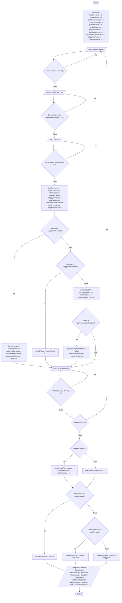

**Penanggung jawab:** Bryant Anthony Kores Obhetan / 322610003

## Flowchart

```mermaid
flowchart TD
    A([Mulai]) --> B["Inisialisasi:<br>totalRencana = 0, totalRealisasi = 0<br>totalPenghematan = 0, totalKelebihan = 0<br>jumlahHemat = 0, jumlahTepat = 0, jumlahMelebihi = 0<br>totalKomponen = 0, penyimpanganTerbesar = 0<br>komponenTerbesar = '-', kondisiKegiatan = '-'"]
    
    B --> C[/"Input namaKomponen"/]
    C --> D{"namaKomponen kosong?"}
    D -- Ya --> C
    D -- Tidak --> E[/"Input anggaranRencana"/]
    
    E --> F{"Bukan angka atau anggaranRencana <= 0?"}
    F -- Ya --> E
    F -- Tidak --> G[/"Input realisasi"/]
    
    G --> H{"Bukan angka atau realisasi < 0?"}
    H -- Ya --> G
    H -- Tidak --> I["totalKomponen = totalKomponen + 1<br>totalRencana = totalRencana + anggaranRencana<br>totalRealisasi = totalRealisasi + realisasi<br>selisih = realisasi - anggaranRencana"]
    
    I --> J{"realisasi < anggaranRencana?"}
    J -- Ya --> K["jumlahHemat = jumlahHemat + 1<br>totalPenghematan = totalPenghematan + (anggaranRencana - realisasi)"]
    J -- Tidak --> L{"realisasi == anggaranRencana?"}
    
    L -- Ya --> M["jumlahTepat = jumlahTepat + 1"]
    L -- Tidak --> N["jumlahMelebihi = jumlahMelebihi + 1<br>totalKelebihan = totalKelebihan + selisih"]
    
    N --> O{"selisih > penyimpanganTerbesar?"}
    O -- Ya --> P["penyimpanganTerbesar = selisih<br>komponenTerbesar = namaKomponen"]
    O -- Tidak --> Q
    
    K --> Q[/"Input pilihan lanjut (y/t)"/]
    M --> Q
    P --> Q
    
    Q --> R{"Pilihan bukan y, Y, t, atau T?"}
    R -- Ya --> Q
    R -- Tidak --> S{"Pilihan y atau Y?"}
    S -- Ya --> C
    
    S -- Tidak --> T{"totalRencana > 0?"}
    T -- Ya --> U["persentasePenyerapan = (totalRealisasi / totalRencana) * 100"]
    T -- Tidak --> V["persentasePenyerapan = 0"]
    
    U --> W{"totalRealisasi < totalRencana?"}
    V --> W
    
    W -- Ya --> X["kondisiKegiatan = 'Hemat'"]
    W -- Tidak --> Y{"totalRealisasi == totalRencana?"}
    
    Y -- Ya --> Z["kondisiKegiatan = 'Sesuai Anggaran'"]
    Y -- Tidak --> AA["kondisiKegiatan = 'Melebihi Anggaran'"]
    
    X --> AB[/"Tampilkan Laporan Rekapitulasi:<br>Total Rencana, Realisasi, Penghematan, Kelebihan, Penyerapan,<br>Statistik Komponen, Penyimpangan Terbesar, dan Kondisi Keseluruhan"/]
    Z --> AB
    AA --> AB
    
    AB --> AC([Selesai])
```
